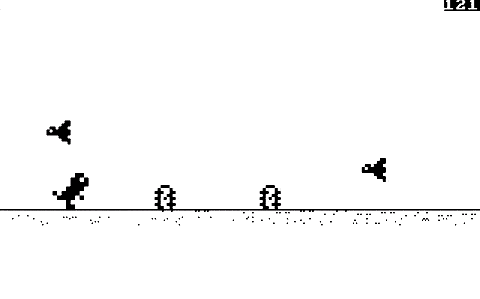

# dino

```
;  ______     ______     __      __     ______        ;
;  \      \   \_    _\   \  \\   \  \   \      \      ;
;   \  \\  \     \  \     \  \`\  \  \   \  \\  \     ;
;    \  \\  \     \  \     \  \ `\ \  \   \  \\  \    ;
;     \  ``  \    _\  \_    \  \  `\\  \   \  ``  \   ;
;      \_____/    \______\   \__\   `\__\   \______\  ;
;        A tiny game in 512 bytes (bootsector)        ;
```

Dino is a bootsector game (512 bytes) written in 16-bit x86 assembly, that's based on Chrome's t-rex runner game!

---
* [How to compile](#how-to-compile)
* [How to play](#how-to-play)
* [Controls](#controls)
* [Acknowledgements](#acknowledgements)
---



## How to compile
To compile `dino` you'll need to have `nasm` installed on your machine.

* If you have `make` installed, just use it like so:
```sh
$ make
```

* If you want to compile by hand, use:
```sh
$ nasm -f bin -o a.bin dino.asm
```

* Alternatively, if you want to generate a 1440KiB floppy disk image, use:
```sh
$ make floppy
```

## How to play
There are various ways to play this: you can either use an x86 emulator, or burn the binary to a floppy (or some other medium), and try booting your old pc off of it.

I recommend using an emulator, namely `qemu`.

* To use `qemu`, first download binary (a.bin) from the [releases section](https://github.com/franeklubi/dino/releases), then run this command:
```sh
$ qemu-system-x86_64 a.bin || qemu-system-i386 a.bin
```

* If you have `make`, `nasm` and `qemu` installed, you can just use this command:
```sh
$ make run
```

## Controls
* Use `shift` to jump
* Use `ctrl` to crouch

## Acknowledgements
* I wish to thank [nanochess (Oscar Toledo)](https://github.com/nanochess) for inspiring me to make this project and for writing his book ([Programming Boot Sector Games](https://nanochess.org/store.html)), that helped me greatly.
* I'd also like to thank Mateusz, for helping me with creating the sprites included in the code.


<small>
For now, the game can be assembled for CPU 186 and up
</small>
<br>
<small>
Dino: 512 bytes
</small>
<br>
<small>
This README: 2181 bytes (not counting the preview gif)
</small>
